# State of the NXT

## Creation info

**Author:** David M. Kaplan (NXT: 409265435876025552, BTC: 12EZmrowPGxYL7yZMTZfVKc6i5eLyCdDEs)

**Date:** Thu Mar 13 09:07:51 2014

**NXT Block Height:** 87404 

**Copyright:** David M. Kaplan (2014)

## Summary

This report consists of statistical analyses of the NXT blockchain to assess network activity and buy-in.  Time series of NXT transaction activity are calculated, and the set of NXT accounts is analyzed for wealth distribution and investment level.  Time series analyses indicate that after an initial period of intense interest and activity, NXT transaction levels have declined steadily over the last ~2 months.  This suggests that potential NXT investors are waiting for new features or dynamics to come online before investing in the NXT network.  The recent downturn in Bitcoin's fortunes undoubtedly also has had an effect on the entire cryptocurrency market.  Nevertheless, the number of NXT accounts continues to grow and the fraction of all NXT that is forging has remained relatively stable.

95% of all NXT are deposited in ~460 NXT accounts.  NXT accounts can be broken down into well identifiable groups based on account activity and balance.  This account clustering analysis suggests that ~840 accounts represents the core group of NXT activists and investors.  The majority of the remaining NXT accounts consists of one-time-use, low-balance faucet accounts.  

The alias system has attracted significant interest, whereas the message system has received limited use.  The prior is in part due to significant speculation by a small group of NXT users and the current low cost of assigning aliases.  The latter will likely change as new features, such as asset exchange, come online.

Overall, this analysis suggests that NXT has a non-negligible community, but needs a shakeup in order to assure continued growth and increase investor and vendor buy-in. 

## Caveats

The analyses discussed here are based on *accounts*, not *individuals*.  As individuals may use multiple accounts, it is difficult or impossible to truly identify individuals.  Therefore, interpreting a number of accounts as representing a number of individual NXT investors is dangerous.  As current NXT wallets make it inconvenient for a single individual to use a large number of different accounts, this analysis of accounts is probably an acceptable representation of NXT activity and interest.  But one cannot be sure, and this will likely change with time.

Similarly, calcutations of alias assignment rates indicate numbers of transactions, not numbers of distinct aliases.  This can be corrected with a more careful analysis, particularly now that the full NXT source code is available.  As the alias system is in its infancy and the number of alias reassignments is undoubtedly low, this is probably only a small error in the analyses at this time.

## NXT activity time series

Here I assess temporal trends in transactions and blocks of the NXT network.

### Transactions

A daily time series of NXT transaction activity is shown below:

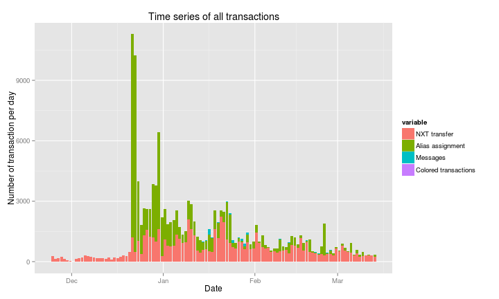

**Figure 1. Stacked bar plot of NXT transactions by type.**

The transaction time series is dominated by a peak towards the end of December 2013 that is related to wider NXT distribution and, in particular, alias assignments.  One must eliminate alias assignments to see the detail of other transaction types.

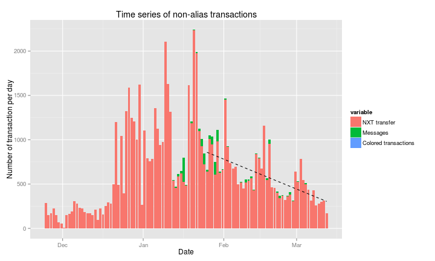

**Figure 2. Stacked bar plot of NXT transactions by type without alias assignments. Dashed black line indicates recent linear trend in NXT transfer transactions.**

Not surprisingly, message transactions make up only a small percentage of total transactions at this time.  More interesting is the appearance of a semi-regular bi-monthly peak in transaction activity over the last two months.  Perhaps paychecks are burning a whole in investor's pockets?

Potentially worrisome, there is a clear downward trend in the number of NXT transfers over the last couple of months.  This downward trend is also visible in the volume of NXT transferred per day:

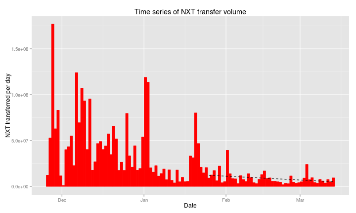

**Figure 3. Time series of volume of NXT tranferred per day with linear trend for recent transfer volume. Note that the genesis block has been eliminated from this analysis.**

This recent stabalization and decrease in transfers indicates to me that the NXT market is in a wait-and-see state.  Major investments have already been made and investors are waiting for new NXT features (e.g., asset transfer) and wider uptake of NXT.  Recent events in the BTC community may also be dragging down interest in cryptocurrencies as a whole.  None of this is really surprising, but does suggest that something new is needed to avoid longterm decline in NXT uptake.

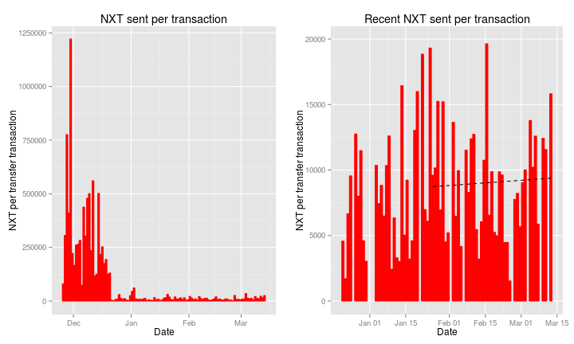

**Figure 4. Time series of the average amount of NXT sent per transfer transaction for each day.  Panel to the right is a zoom on the most recent time period.**

There is also a downward trend in the [number of NXT sent per transaction](#f.ts_nxt_per_trans), though the trend is less notable than that for the number of transactions.

For completeness, here are time series of alias assignments and message transactions:

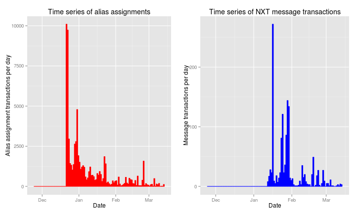

**Figure 5. NXT alias assignment and message transactions per day.**

### Fees and forging

The number of blocks generated per day is not surprisingly uninteresting:

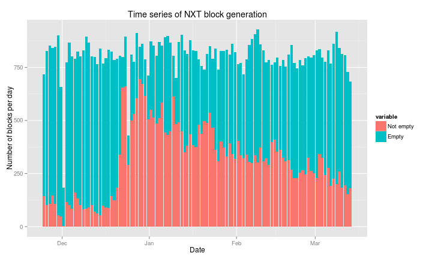

**Figure 6. Stacked bar plot of NXT block generation per day.  Empty blocks had no transactions.**

More interesting is that the number of blocks with transactions is declining rather steadily over time, not surprising given the discussion of transactions above (e.g., [Figure 2](#f.ts_stack_bar_noaliases)).  This decline is also evident in the fees collected per day:

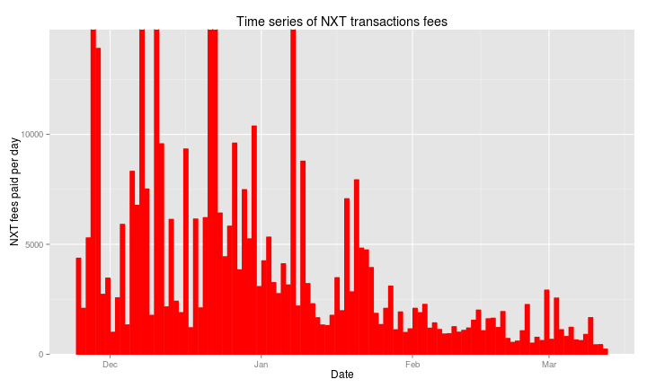

**Figure 7. NXT transaction fees paid per day. Note that y-limits have been scaled so that recent fee activity is visible at the expense of cutting off early peaks in fees paid.**

Looking at which accounts are doing the forging, the number of distinct accounts successfully forging a block has stabalized at around ~80 per day:

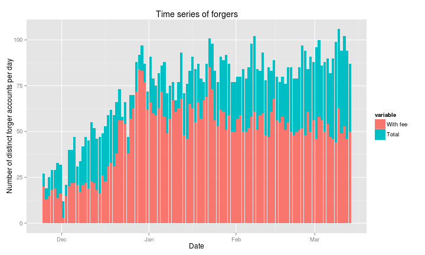

**Figure 8. Time series of the number of distinct accounts that forged at least one block per day.  Red bars show distinct accounts that forged a non-empty block.**

On a day-by-day basis, there is a growing gap between the number of accounts forging and the number of accounts making some NXT off of that forging.  Naively, one would expect the number of accounts gaining a fee to be strictly proportional to the number of accounts forging a block.  This should be the case over longer time scales, but on a daily timescale, as the number of non-empty blocks has decreased, accounts need to forge multiple blocks per day to gain a non-zero fee.  Only a small number of high-NXT accounts have the potential to do this, leading to the widening day-by-day gap between forgers and forgers with a fee.

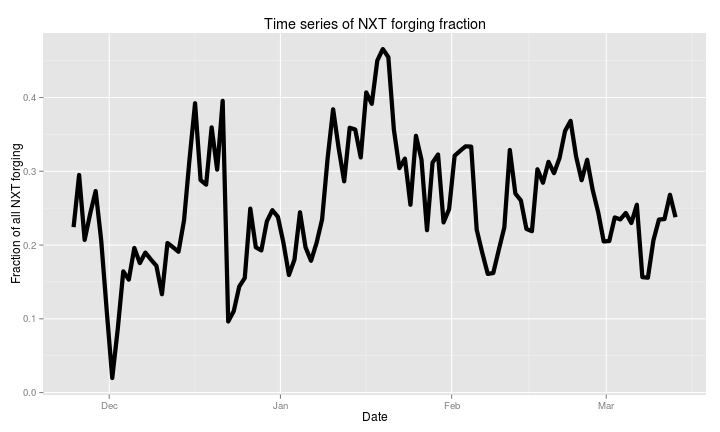

**Figure 9. Time series of the mean fraction of NXT that is forging each day.  Fraction is estimated from the inverse of the base target rate.**

Despite these downward trends in fees, the fraction of all NXT that is actively forging has remained relatively stable at ~20 to 30% since mid-January, though there is some hint of a decline over the last two weeks (**note:** there are some magic numbers involved in these calculations that I don't understand; my use of the base target follows what is on NXT Blockchain explorer and in forums, but I don't fully understand how it works).

## Analysis of NXT accounts

Whereas in the previous section analyses focused on time series, here I look at the statistical properties of the set of NXT accounts at the present time.  But before doing so, some plots of the total number of NXT accounts and the number of new NXT accounts over time:

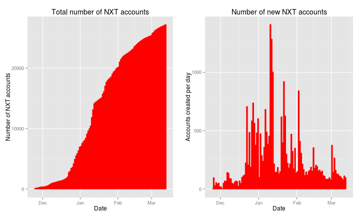

**Figure 10. Total number of NXT accounts and number of new NXT accounts created on each day.**

### Distribution of wealth among accounts

It is interesting to look at how NXT and NXT transaction activity is distributed among the 27226 NXT accounts existing at this time.  Considering total, present-day balances for all accounts, the distribution of NXT wealth is less concentrated than I initially would have expected:

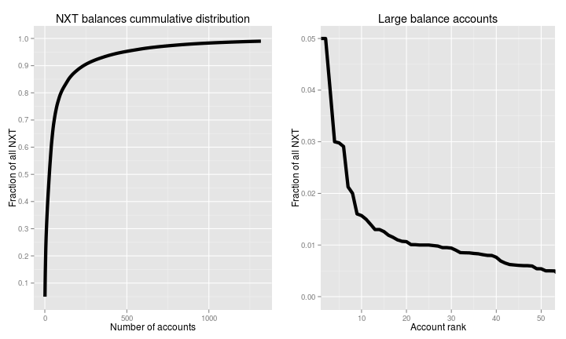

**Figure 11. Representation of all NXT in large accounts.  Panel on left shows cummulative distribution of all NXT by number of accounts summing from largest accounts to smallest (i.e., the 475 largest NXT accounts represent 95% of all NXT).  Panel on right shows fraction of all NXT in largest individual NXT accounts.**

Though 50% of all NXT are represented by only 27 large NXT accounts, 475 accounts are required to represent 95% of all NXT and 1314 accounts are required to represent 99% of all NXT.  The largest single account represents 5.12% of all NXT, but only 25 accounts have more than 1% of all NXT in them.

On the other hand, the vast majority of NXT accounts are indeed very small compared to the big fish.  34.2% of all accounts have a zero balance, and 48.4% of accounts have never held more than 5 NXT (presumably these are primarily faucet accounts).

Collectively, this leads to a Gini index of inequality of 0.993 (0.986 eliminating "faucet" accounts).  Basically, if NXT were a country, it would be the most unequal on the planet.  However, this isn't a fair comparison.  Better would be to compare the NXT Gini index to that of a small- to medium-sized publicly traded company shortly after the IPO.  I don't have these statistics, but I imagine someone does.  

**Table 1. 20 accounts with the largest balances.**

Account ID | NXT Balance
--- | ---
2159498187382012684 | 51189350
4747512364439223888 | 50003231
10715382765594435905 | 39246584
16386134630970163904 | 30002058
14241151062656421686 | 29781158
14571285356259793594 | 29080360
15985892217534139770 | 22755391
14335468932354642520 | 20000002
2584657662098653454 | 19506820
12292439833850569026 | 16019884
8797677203327163788 | 15002211
4726268575002224579 | 14019331
14545912576558326517 | 13000010
12498477219426695690 | 12999999
8517842408878875334 | 12600378
12968364353024827435 | 11900451
10764010510447896395 | 11500001
12195823548299562711 | 11000108
17102374048997504131 | 10724279
6993457166141424000 | 10651531

## <a name="nxt_sent">NXT sent</a>

NXT transfer transactions are not surprisingly more evenly distributed among accounts than NXT coins themselves.  9056 accounts are needed to represent 95% of all NXT send transactions.  5 accounts have sent NXT more than 1000 times and only 2 accounts have sent NXT more than 10000 times.  The number 1 transfer account has 14805 transfers, but only a small number of NXT receipts.  This account belongs to the NXT faucet system suggesting that 14805 NXT accounts have received faucet deposits. 

The other large-send accounts are most likely associated with the large exchanges.  Indeed, one of the accounts is known to belong to DGEX. 

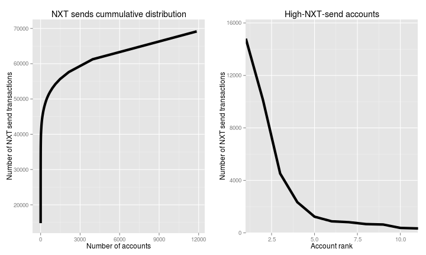

**Figure 12. Accounts representing large numbers of NXT send transactions.  Panel on left shows cummulative distribution of all NXT send transaction by number of accounts summing from largest accounts to smallest (i.e., the 9056 NXT accounts with the most send transactions represent 95% of all NXT send transactions).  Panel on right shows number of NXT send transactions in high transfer accounts.**

**Table 2. 20 accounts with the largest number of send transactions.**

Account ID | Balance | Send trans. | Receive trans. | Alias trans. | Messages | Blocks forged
--- | --- | --- | --- | --- | --- | ---
6973288302950136231 |    54792 | 14805 |   41 |  0 | 0 |    1
6635869272840226493 |  1568058 | 10123 | 2349 |  3 | 0 |  834
10715382765594435905 | 39246584 |  4522 | 2816 |  0 | 0 |    0
6373287686743005570 |        0 |  2338 |   28 |  1 | 0 |    0
16999902190493953875 |        0 |  1234 |   10 |  0 | 0 |    0
5874614062205245396 |   195322 |   881 |   11 |  0 | 0 |    0
3243382701527979272 |  3560124 |   815 |  713 |  0 | 0 |  291
3283108578452123518 |    11723 |   670 |  258 |  2 | 1 |   36
5271441507933314159 |     6010 |   636 |   29 |  0 | 2 |    0
16134594343943118807 |        0 |   377 |    9 |  0 | 0 |    0
10706932307795908833 |    26499 |   340 |  169 |  0 | 0 |    2
14097892515512707759 |        0 |   297 |    7 |  0 | 0 |    1
2584657662098653454 | 19506820 |   291 |   25 |  3 | 0 | 7222
9795201389880306166 |      308 |   281 |    5 |  3 | 0 |    4
15433843940533216836 |     5848 |   252 |    9 |  0 | 0 |    0
14862341717956808439 |        0 |   251 |  179 | 11 | 0 |    0
5810532812037266198 |   408651 |   229 |  556 |  0 | 0 |   30
5358256819457330449 |      349 |   222 |  235 |  0 | 0 |    0
8455730809611950696 |        0 |   218 |  427 |  0 | 0 |    0
2269220637361284198 |   177513 |   215 |  195 |  0 | 0 |    0

## NXT received

Receipt of NXT transactions are quite evenly distributed among accounts as all accounts must receive NXT at least once and only a few accounts have received NXT many times.  Faucet accounts are clearly visible in the cummulative distribution of NXT receipts by the linear growth between number of accounts and number of transfers received after about 10000 accounts.

Only 3 accounts have received NXT more than 1000 times.  Again, these accounts are undoubtedly associated with exchanges.

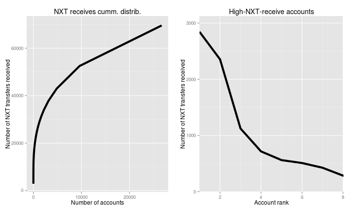

**Figure 13. Accounts receiving large numbers of NXT transfers.  Panel on left shows cummulative distribution of all NXT transactions received by number of accounts summing from largest "receivers" to smallest (i.e., the 23777 NXT accounts receiving the most NXT transfers represent 95% of all NXT transfers).  Panel on right shows number of NXT transfers received in high transfer accounts.**

**Table 3. 20 accounts with the largest number of NXT transfers received.**

Account ID | Balance | Send trans. | Receive trans. | Alias trans. | Messages | Blocks forged
--- | --- | --- | --- | --- | --- | ---
10715382765594435905 | 39246584 |  4522 | 2816 |  0 | 0 |   0
6635869272840226493 |  1568058 | 10123 | 2349 |  3 | 0 | 834
14343293611098709683 |   418725 |     1 | 1124 |  2 | 0 |   0
3243382701527979272 |  3560124 |   815 |  713 |  0 | 0 | 291
5810532812037266198 |   408651 |   229 |  556 |  0 | 0 |  30
13117504042955556224 |        0 |    10 |  511 |  0 | 0 |   0
8455730809611950696 |        0 |   218 |  427 |  0 | 0 |   0
15980594212357713161 |     1395 |   134 |  287 |  0 | 1 |   0
3283108578452123518 |    11723 |   670 |  258 |  2 | 1 |  36
5358256819457330449 |      349 |   222 |  235 |  0 | 0 |   0
4820961698192368997 |        0 |    22 |  209 |  2 | 0 |   0
6744761866455172564 |        0 |    12 |  208 |  0 | 0 |   0
2269220637361284198 |   177513 |   215 |  195 |  0 | 0 |   0
1113619626464209637 |     9619 |    59 |  180 | 14 | 0 | 320
14862341717956808439 |        0 |   251 |  179 | 11 | 0 |   0
17093633478753342904 |   182642 |    63 |  172 |  0 | 0 |  30
10706932307795908833 |    26499 |   340 |  169 |  0 | 0 |   2
10000061009900011000 |   360335 |    32 |  161 |  1 | 0 |  22
1215916677171016246 |   255319 |    72 |  154 |  0 | 0 |  24
4427320429393039971 |        0 |     2 |  121 |  0 | 0 |   0

## Alias assignments

The NXT alias system has been rather successful, with 70975 alias assignments to date, and 136 accounts having registered more than 100 aliases.  The alias system seems to be attracting a somewhat different type of speculator than the main NXT transaction system as some accounts with a large number of aliases have very low balances and have only a very minor level of participation in other aspects of the NXT system.  Alternatively, NXT users may be purposely separating primary deposit accounts from alias registration accounts.

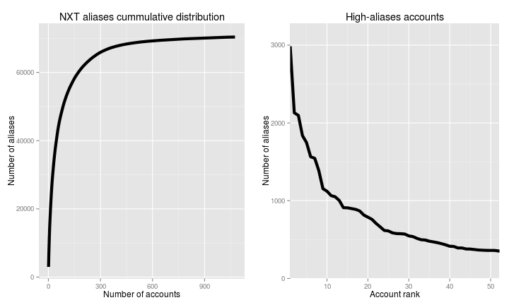

**Figure 14. Accounts representing large number of aliases (really alias assignments).  Panel on left shows cummulative distribution of all NXT aliases by number of accounts summing down from accounts with most aliases (381 NXT accounts control 95% of all NXT aliases).  Panel on right shows number of NXT aliases owned by accounts with a large number of alias assignments.**

**Table 4. 20 accounts with the largest number of alias assignment transactions.**

Account ID | Balance | Send trans. | Receive trans. | Alias trans. | Messages
--- | --- | --- | --- | --- | ---
18384674354580664306 |      0 |  1 | 13 | 2986 | 0
8777528113398257759 | 236845 |  3 |  8 | 2131 | 0
2345678935869777788 |     61 |  3 |  8 | 2097 | 0
215380741547059929 |     70 |  0 | 13 | 1837 | 0
14205721421835156777 | 157053 |  3 |  7 | 1746 | 0
15984016006810380818 |    228 |  6 |  1 | 1565 | 0
15020229329826983635 |  51838 |  0 |  2 | 1546 | 0
7536079473328214481 |     24 |  0 | 12 | 1386 | 0
11841724102579694951 |  22290 | 12 |  8 | 1155 | 0
6792768222481525937 |    178 |  0 |  3 | 1122 | 0
6590397755438155117 |  12184 |  5 |  4 | 1066 | 0
13772099588186083271 |   1918 |  6 |  9 | 1051 | 0
14174112712561267747 |    368 | 12 | 10 | 1003 | 0
3152075506729844409 |   1141 |  0 |  8 |  911 | 0
7410447374099440095 |      0 |  3 | 14 |  909 | 0
9266078219842661925 |      3 |  2 |  4 |  899 | 0
4049212190968300517 |    123 |  5 | 13 |  889 | 0
9665584253807221533 |    108 |  6 |  4 |  868 | 0
15003961341330858247 |     73 | 15 | 62 |  816 | 0
11815625841889064569 | 156220 |  1 |  5 |  789 | 0

## Message system use

The message system has received only limited use, with 1384 messages sent to date, and 4 accounts sending 73.12% of all messages.  3 of those 4 accounts have only sent messages back and forth between each other, suggesting a development network.  Backtracking deposits to those messaging accounts leads to [info.nxtcrypto.org](http://info.nxtcrypto.org) and deep NXT pockets, indicating that this group of 3 accounts belongs to the core group of NXT developers and/or was used for testing purposes by that group.  

The fourth account has sent a small number of messages (generally 1-2) to a large number of different recipients (none of which correspond to the other 3 major users of the message system).  Backtracking NXT deposits to this account, one can identify this as some sort of development or investment network for an alternative NXT client.  

None of these 4 accounts have large balances or transfer activity, indicating that users are separating message accounts from NXT deposit accounts.

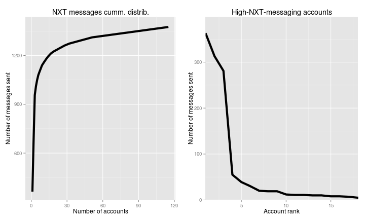

**Figure 15. Accounts sending large numbers of NXT messages.  Panel on left shows cummulative distribution of all NXT messages sent summing from largest sending accounts to smallest (56 NXT accounts sent 95% of all NXT messages).  Panel on right shows number of messages sent by accounts sending most messages.**

**Table 5. 20 accounts sending the largest number of messages.**

Account ID | Balance | Send trans. | Receive trans. | Alias trans. | Messages | Num. distinct message recipients
--- | --- | --- | --- | --- | --- | ---
15517271740184245952 |    165 |  2 |  3 |   0 | 363 |   3
7125717598282589011 |    128 |  2 |  3 |   0 | 313 |   3
8450504352895951699 |    119 | 45 | 18 |   6 | 281 | 208
1193251248491275771 |     70 |  0 |  3 |   0 |  55 |   2
14285145359400389627 |    134 |  0 |  4 |   0 |  39 |   1
5687942189255392308 |  10576 | 16 | 25 |  16 |  30 |   5
3318775965261640436 |      0 |  0 |  1 |   0 |  20 |   1
11705421818017332297 |      0 |  3 |  1 |   0 |  19 |   2
3748394126938295440 |      0 |  1 |  1 |   0 |  19 |   1
1758531264253431177 |   2229 | 19 | 80 |   7 |  12 |   9
16630136009793992357 |      2 | 20 |  2 |   1 |  11 |   2
17550670912851236066 |  16905 | 20 |  3 |   3 |  11 |   3
15995451167544862862 |      0 |  4 |  4 |   0 |  10 |   1
8314138405518034186 |    229 |  1 |  1 |   0 |  10 |   1
10885957827193659290 |    431 |  2 |  2 | 479 |   8 |   1
14129785748797593446 | 306923 |  1 | 11 |   0 |   8 |   2
8189784314684138350 |  51211 |  3 | 55 |   2 |   6 |   4
13506390574400724639 |   6000 | 17 | 49 |   4 |   5 |   2
18121436946058662912 |      0 |  4 |  2 |   0 |   5 |   1
10260372437324455574 |      8 |  6 |  8 |   5 |   4 |   2

## Account clustering

Finally, it is interesting to look at how accounts cluster in terms of activity types and amounts.  Here I have used simple K-means clustering to separate accounts into 7 groups as determined by the following variables: number of transfers received, number of transfers sent, NXT received, NXT sent, number of alias assignments, number of messages sent, number of blocks forged, balance, and length of active time period (time between first and last receive or send transaction).  K-means is a simple clustering method, but it has the advantage of being easy and fast.  I chose 7 groups because that seemed about right based on more sophisticated clustering analyses on a subset of accounts.

**Table 6. Median statistics for accounts in each of the 7 k-means cluster groups.**

Group | Num. accts. | Receive trans. | Send trans. | NXT received | NXT sent | Message trans. | Alias assignments | Blocks forged | Balance | Days active
--- | --- | --- | --- | --- | --- | --- | --- | --- | --- | ---
1 | 2 | 2582 | 7322 | 214467718 | 194055692 | 0 | 2 | 417 | 20407321 | 79
2 | 9 | 14 | 16 | 46888715 | 3261040 | 0 | 0 | 3633 | 29080360 | 43
3 | 23 | 8 | 3 | 25750 | 14343 | 0 | 1051 | 0 | 368 | 13
4 | 34 | 4 | 10 | 34913207 | 34870544 | 0 | 0 | 55 | 7 | 17
5 | 770 | 6 | 3 | 33436 | 7501 | 0 | 0 | 0 | 1104 | 48
6 | 2320 | 4 | 2 | 5122 | 350 | 0 | 0 | 0 | 10 | 18
7 | 24119 | 1 | 0 | 5 | 0 | 0 | 0 | 0 | 2 | 0

Clustering results break accounts down into recognizable categories.  Group 1 contains 2 accounts with high balances and high numbers of NXT deposits and payments.  These are the exchange accounts previously identified (see Section [NXT sent](#nxt_sent)).

Group 2 consists of 9 accounts with large balances and long activity times, but relatively low transaction rates.  This suggests a group of initial NXT investors that have held onto their NXT, but are not particularly active in the network at this time.

Group 3 consists of 23 accounts characterized by a high number of alias assignments.  These are the namespace trolls.

Group 4 consists of 34 accounts characterized by high NXT deposits *and* payments, but balances that are relatively low compared to groups 1 and 2 and short account activity times.  This would suggest initial NXT investors that rapidly divested from the network to make a quick buck.

Group 5 consists of 770 accounts with low numbers of transactions, small, but non-negligible, deposits and balances, and relatively long account activity times.  These are perhaps the "believers", small-time investors that have held onto their NXT.

Group 6 consists of 2320 accounts that are similar to group 5 accounts, but that sold-out relatively rapidly and have little remaining balance - small-time investors that got in and out quickly.

Group 7 consists of 24119 accounts that are clearly faucet accounts: little balance, 1 NXT deposit, extremely short activity times.

Given this analysis, one can estimate the core number of NXT investors and activists to consist of groups 1-5 for a grand total of 838 accounts.

## TODO list

Additional analyses that would be nice additions at some point:

* Break down account creation time series by current account status or class (e.g., to eliminate faucet accounts).
* Individual account time series for large accounts and maximum/minimum balance calculations for each account.
* Analysis of alias assignments by distinct aliases instead of transactions
* Comparison of NXT Gini and other inequality statistics with those from companies shortly after IPOs.
* Network analysis of transactions, messages, etc.
* Include external indicators of NXT valuation: NXT exchange volumes and prices.
